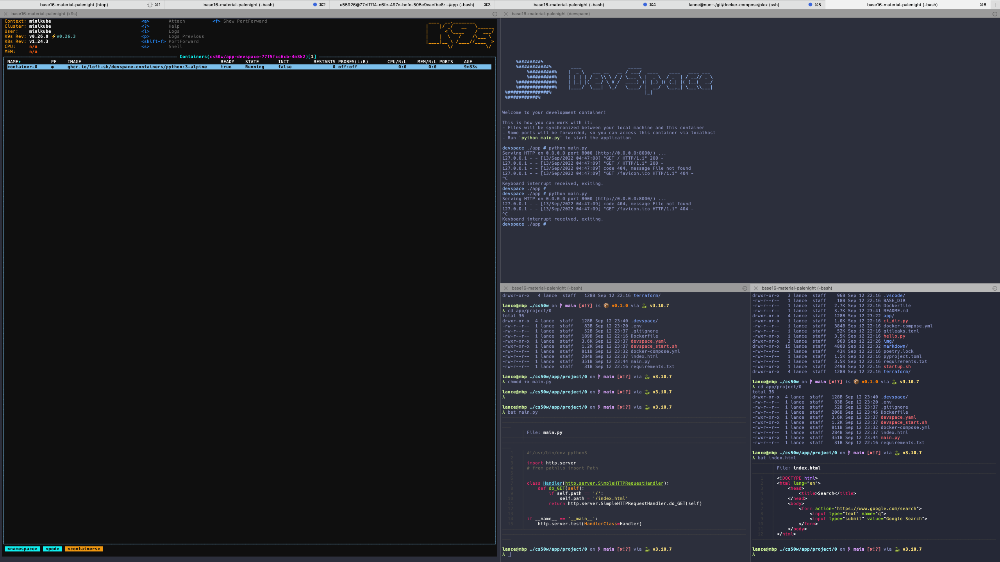
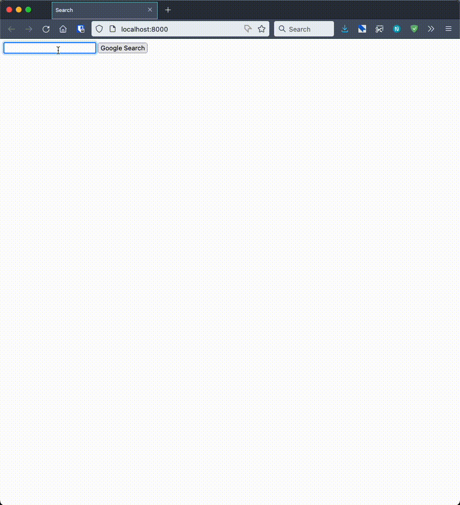

# CS50 Web Programming with Python and JavaScript


## Summary
From the [course authors](https://cs50.harvard.edu/web/2020/):
> This course picks up where CS50x leaves off, diving more deeply into the design and implementation of web apps with Python, JavaScript, and SQL using frameworks like Django, React, and Bootstrap. Topics include database design, scalability, security, and user experience. Through hands-on projects, students learn to write and use APIs, create interactive UIs, and leverage cloud services like GitHub and Heroku. By semester’s end, students emerge with knowledge and experience in principles, languages, and tools that empower them to design and deploy applications on the Internet.

**Table of Contents**
* [CS50 Web Programming with Python and JavaScript](#cs50-web-programming-with-python-and-javascript)
  * [Summary](#summary)
  * [Setup](#setup)
  * [Usage](#usage)
  * [TODO](#todo)
  * [Further Reading](#further-reading)

## Setup
* Install
    * [editorconfig](https://editorconfig.org/)
    * [asdf](https://asdf-vm.com/guide/getting-started.html#_2-download-asdf)
    * [poetry](https://python-poetry.org/docs/)
    * [docker-compose](https://docs.docker.com/compose/install/)
    * [k9s](https://github.com/derailed/k9s#installation)
    * [minikube](#kubernetes-k8s)
    * [helm](https://helm.sh/docs/intro/install/)
    * [devspace](https://devspace.sh/docs/getting-started/introduction)

## Usage
* [k9s](markdown/kubernetes.md#k9s)
* Minikube
    ```bash
    # install
    brew install minikube

    # set cluster driver permanently
    minikube config set driver docker

    # options
    minikube start --memory=2048 --cpus=2 -p minikube

    # profile list
    minikube profile list
    ```
* [DevSpace](https://loft.sh/blog/python-django-development-on-kubernetes-with-devspace/)
    ```bash
    # install devspace
    brew install devspace

    # upgrade
    devspace upgrade

    # select context (cluster)
    devspace use context minikube

    # wizard
    λ cd app/project/0
    λ devspace init

        %########%
        %###########%       ____                 _____
            %#########%    |  _ \   ___ __   __ / ___/  ____    ____   ____ ___
            %#########%    | | | | / _ \\ \ / / \___ \ |  _ \  / _  | / __// _ \
        %#############%    | |_| |(  __/ \ V /  ____) )| |_) )( (_| |( (__(  __/
        %#############%    |____/  \___|  \_/   \____/ |  __/  \__,_| \___\\___|
    %###############%                                  |_|
    %###########%

    ? Docker Compose configuration detected. Do you want to create a DevSpace configuration based on Docker Compose? Create a new devspace.yaml from scratch

    info Detecting programming language...

    ? Select the programming language of this project python
    ? How do you want to deploy this project?
    ? Do you already have a Helm chart for this project?
    ? Do you want to develop this project with DevSpace or just deploy it?  [Use arrows to move, type to filter] I want to develop this project and my current working dir contains the source code
    ? How should DevSpace build the container image for this project? Use this existing Dockerfile: ./Dockerfile
    ? If you were to push any images, which container registry would you want to push to? Skip Registry
    ? Which port is your application listening on? (Enter to skip) 8000

    done Project successfully initialized
    info Configuration saved in devspace.yaml - you can make adjustments as needed

    # change namespace from default
    devspace use namespace cs50w

    # list variables in devspace.yaml
    devspace list vars

    # run pod
    devspace dev

    # delete deployed resources
    devspace purge
    ```
    
    

## TODO
* ~~Switch out DevSpace default image in `devspace.yaml`~~
* Refactor [advanced.html](app/project/0/advanced.html) to match [Google Advanced Search](https://www.google.com/advanced_search)

## Further Reading
[CS50's Web Programming with Python and JavaScript | edX](https://www.edx.org/course/cs50s-web-programming-with-python-and-javascript)

[Config Reference | DevSpace | Documentation](https://www.devspace.sh/docs/configuration/reference)
